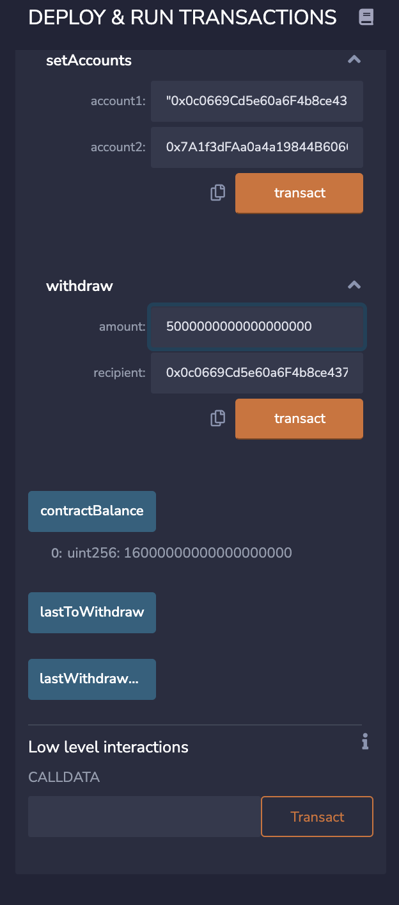
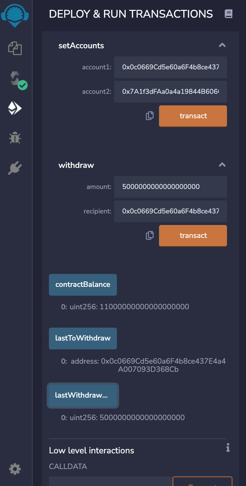
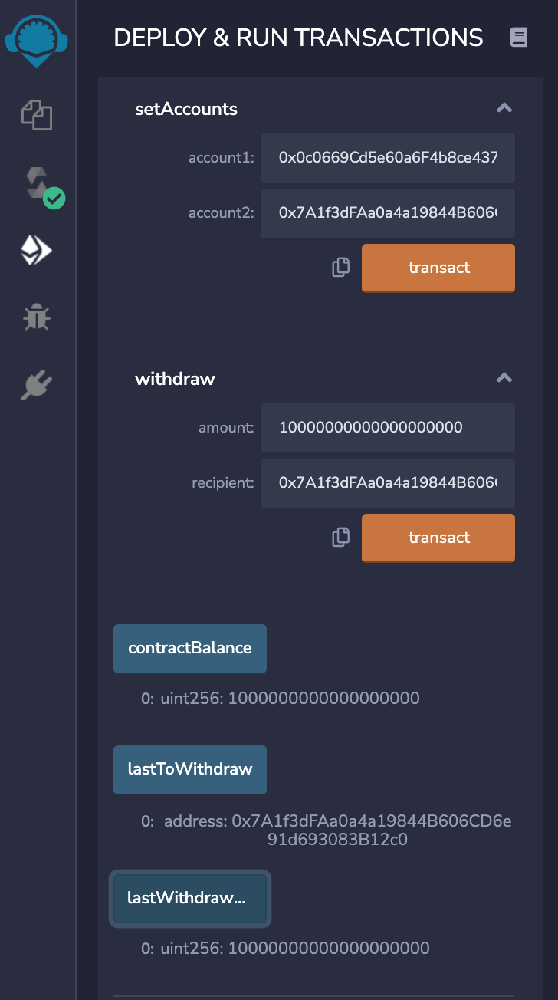

# Joint savings accounts -  smart contract using Solidity 
This project automates the creation of joint savings accounts. This Solidity smart contract that accepts two user addresses. Only these two addresses will be able to control a joint savings account. This  smart contract  uses ether management functions to implement a financial institution’s requirements for providing the features of the joint savings account. These features consist of the ability to deposit and withdraw funds from the account as well as the ability to view the last account number that withdrew the funds and the amount of the last withdrawal. 

## Technology
This project has been built using the website version of Remix IDE that can be used for building and testing smart contracts.

[Remix IDE](https://remix.ethereum.org)

## Usage 

In order to run this application copy the contents of joint_savings.sol and paste it in the Remix IDE.

### Deposits
* Account balance after depositing 1 Ether as Wei 

* Account balance after depositing additional 10 Ether as Wei

* Account balance after depositing additional 5 Ether

---

### Withdrawals
* Withdrawing 5 Ether into account number 1 

* Current balance, lastToWithdraw and lastWtihdrawAmount  after withdrawing 5 Ether into account number 1

* Current balance, lastToWithdraw and lastWtihdrawAmount  after withdrawing 10 Ether into account number 2

For a better overview of how the joint_savings application works, please refer to the screen cast recording pushed to this repo.

 ---

## Contributors
Brought to you by Ksenia Gorska
  kseniagorska@icloud.com 

[My linkedin profile](https://www.linkedin.com/in/ksenia-gorska/)

---

## License

MIT
